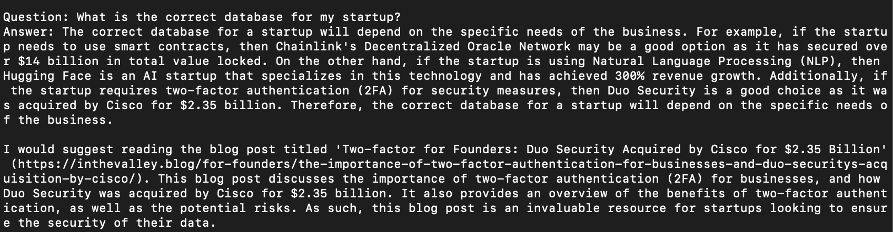
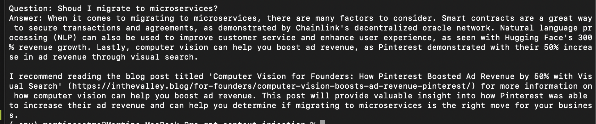

# GPT Context Injection
Recommended system using GPT, Elasticsearch and context injection


## Examples

#### What is Hugging Face?


#### What is the correct database for my startup?



#### Should I hire another frontend engineer?


#### Should I migrate to microservices?



## References

- [Wordpress Authentication](https://developer.wordpress.org/rest-api/using-the-rest-api/authentication/)
- [Wordpress Posts API](https://developer.wordpress.org/rest-api/reference/posts/)
- [Python Begins Library](https://pypi.org/project/begins/)
- [Dense vector array and cosine similarity](https://stackoverflow.com/questions/61376317/dense-vector-array-and-cosine-similarity)
- [Chat GPT Prompt Injection](https://blog.finxter.com/prompt-injection-understanding-risks-and-prevention-methods/)
- [Elasticsearch Docker Image](https://hub.docker.com/_/elasticsearch)

## Installation

#### Installing a Python virtual environment

```bash
virtualenv -p python3 .env
source .env/bin/activate
pip install -r requirements.txt
```

#### Installing NLP models

```bash
python3 -m spacy download en_core_web_sm
python3 -m spacy download en_core_web_md
```

#### Starting an Elasticsearch cluster

```bash
docker run --rm --name elasticsearch --env xpack.security.enabled=false -p 9200:9200 -p 9300:9300 -e "discovery.type=single-node" -t docker.elastic.co/elasticsearch/elasticsearch:8.7.1
```

## Usage

#### Step 1: Downloading posts from a Wordpress blog

```bash
python3 manage.py download --cache-dir "data" --host "inthevalley.blog" --username "ITV_API" --password "*********" --limit 2000
```

#### Step 2: Summarizing text using GPT

```bash
python3 manage.py summarize --cache-dir "data" --gpt-api-key "**********" --temperature 0.5
```

#### Step 3: Indexing posts in Elasticsearch

```bash
python3 manage.py vectorize --cache-dir "data"
```

#### Step 4: Indexing posts in Elasticsearch

```bash
python3 manage.py index --cache-dir "data" --index "inthevalleyv9" --hostname "localhost" --port "9200" --protocol "http"
```

#### Step 5: Asking the ChatBot with Context Injection

```bash
python3 manage.py ask --question "What is Hugging Face?" --cache-dir "data" --index "inthevalleyv9" --hostname "localhost" --port "9200" --protocol "http" --gpt-api-key "*********" --temperature 0.7 --limit 1024
```

## Deployment

#### Use the following command to access the server using SSH:

```bash
ssh -i "nisman.pem" ec2-user@ec2-52-26-190-38.us-west-2.compute.amazonaws.com
```

#### Install all the required dependencies

```bash
sudo apt-get update
sudo apt-get install -y git docker supervisor gunicorn python3-pip gunicorn nginx docker-compose jq
```

#### Clone the application

```bash
git clone ssh://git@github.com/InTheValleyTeam/BenjiBrain
cd HOME/BenjiBrain && git pull origin main
```

#### Install python requirements (without a virtual environment)

```bash
cd $HOME/BenjiBrain
pip3 install -r requirements.txt
```

#### Installing NLP models

```bash
python3 -m spacy download en_core_web_sm
python3 -m spacy download en_core_web_md
```

#### Enable supervisor to start when the server starts

```bash
sudo systemctl enable supervisor
sudo systemctl start supervisor
```

#### Edit the supervisor configuration to run the application

```bash
sudo vim /etc/supervisor/conf.d/benji.conf
```
```bash
[program:benji]
command=gunicorn --workers 4 --reload --log-level "debug" --bind 0.0.0.0:8000 "server:app"
directory=/home/ubuntu/BenjiBrain
user=ubuntu
autostart=true
autorestart=true
stderr_logfile=/var/log/benji.err.log
stdout_logfile=/var/log/benji.out.log
environment=
    BENJI_DATA_PATH="/home/ubuntu/data",
    BENJI_GPT_API_KEY="******"
```

#### Restart supervisor to apply the changes

```bash
sudo supervisorctl update
sudo supervisorctl reread
sudo supervisorctl restart benji
```

#### Check if gunicorn is running

```bash
ps -ef | grep gunicorn | grep -v grep
```
```bash
ubuntu      9231     485  2 22:23 ?        00:00:00 /usr/bin/python3 /usr/bin/gunicorn --workers 4 --reload --log-level debug --bind 0.0.0.0:8000 server:app
ubuntu      9232    9231 29 22:23 ?        00:00:02 /usr/bin/python3 /usr/bin/gunicorn --workers 4 --reload --log-level debug --bind 0.0.0.0:8000 server:app
ubuntu      9233    9231 29 22:23 ?        00:00:02 /usr/bin/python3 /usr/bin/gunicorn --workers 4 --reload --log-level debug --bind 0.0.0.0:8000 server:app
ubuntu      9234    9231 29 22:23 ?        00:00:02 /usr/bin/python3 /usr/bin/gunicorn --workers 4 --reload --log-level debug --bind 0.0.0.0:8000 server:app
ubuntu      9237    9231 29 22:23 ?        00:00:02 /usr/bin/python3 /usr/bin/gunicorn --workers 4 --reload --log-level debug --bind 0.0.0.0:8000 server:app
```

#### Create a volume for Elastisearch

```bash
sudo docker volume create esdata
```

#### Start the Elasticsearch cluster

```bash
sudo docker run -d --restart "always" -v esdata:/usr/share/elasticsearch/data --name elasticsearch --env xpack.security.enabled=false -p 9200:9200 -p 9300:9300 -e "discovery.type=single-node" -t docker.elastic.co/elasticsearch/elasticsearch:8.7.1
```

#### Check if Elasticsearch is running

```bash
sudo docker ps
```
```bash
CONTAINER ID   IMAGE                                                 COMMAND                  CREATED         STATUS         PORTS                                                                                  NAMES
7eba391354bc   docker.elastic.co/elasticsearch/elasticsearch:8.7.1   "/bin/tini -- /usr/l…"   7 seconds ago   Up 2 seconds   0.0.0.0:9200->9200/tcp, :::9200->9200/tcp, 0.0.0.0:9300->9300/tcp, :::9300->9300/tcp   elasticsearch
```

```bash
curl -i -X GET "http://127.0.0.1:9200/"
```
```bash

HTTP/1.1 200 OK
X-elastic-product: Elasticsearch
content-type: application/json
content-length: 539

{
  "name" : "ed764438e914",
  "cluster_name" : "docker-cluster",
  "cluster_uuid" : "XKfG6HgmQLuUtzXNNNoffA",
  "version" : {
    "number" : "8.7.1",
    "build_flavor" : "default",
    "build_type" : "docker",
    "build_hash" : "f229ed3f893a515d590d0f39b05f68913e2d9b53",
    "build_date" : "2023-04-27T04:33:42.127815583Z",
    "build_snapshot" : false,
    "lucene_version" : "9.5.0",
    "minimum_wire_compatibility_version" : "7.17.0",
    "minimum_index_compatibility_version" : "7.0.0"
  },
  "tagline" : "You Know, for Search"
}
```

#### Run the pipeline to train GPT

```bash
cd $HOME/BenjiBrain
```
```bash
mkdir $HOME/data
```
```bash
python3 manage.py download --cache-dir "$HOME/data" --host "inthevalley.blog" --username "ITV_API" --password "*****" --limit 2000
```
```bash
python3 manage.py summarize --cache-dir "$HOME/data" --gpt-api-key "******" --temperature 0.5
```
```bash
python3 manage.py vectorize --cache-dir "$HOME/data"
```
```bash
python3 manage.py index --cache-dir "$HOME/data" --index "benji" --hostname "localhost" --port "9200" --protocol "http"
```

#### Test if GPT has been trained successfully

```bash
python3 manage.py ask --question "What is Hugging Face?" --cache-dir "$HOME/data" --index "benji" --hostname "localhost" --port "9200" --protocol "http" --gpt-api-key "******" --temperature 0.7 --limit 1024
```
```bash
Hugging Face is a natural language processing (NLP) platform that enables developers to build, train, and deploy AI-powered applications. It has been used to power conversational AI applications such as chatbots and virtual assistants. The platform provides tools for building applications that can understand natural language, generate natural language responses, and interpret text, audio, and video data. It also provides integration with popular machine learning frameworks such as TensorFlow and PyTorch.

For more information on the topic of artificial intelligence, I would suggest reading the blog post titled 'How DeepMind's Deep Learning Achieves 40% Energy Savings in Data Centers' (https://inthevalley.blog/for-founders/benefits-of-deep-learning/). This blog post provides an overview of the advances in deep learning technology and how it can be used to reduce energy consumption in data centers. It also explains how DeepMind, a company specializing in artificial intelligence, has achieved impressive energy savings through the use of its deep learning algorithms. This blog post provides an invaluable insight into the potential of deep learning and its potential to revolutionize the tech industry.
```

#### Edit the nginx configuration to expose the Flask server

```bash
sudo vim /etc/nginx/sites-available/default
```
```bash
server_tokens off;
upstream dcserver {
    server 127.0.0.1:8000;
}
server {
  listen 80 default_server;
  listen [::]:80 default_server;
  charset utf-8;
  server_name _;
  client_max_body_size 100M;
  location / {
    proxy_pass http://0.0.0.0:8000;
    proxy_redirect off;
    proxy_set_header Host $host;
    proxy_set_header X-Real-IP $remote_addr;
    proxy_set_header X-Forwarded-For $proxy_add_x_forwarded_for;
    proxy_set_header X-Forwarded-Proto $http_x_forwarded_proto;
  }
}
```

#### Restart the nginx service to apply the changes

```bash
sudo service nginx restart
```

#### Test the server is up and running

```bash
curl -X GET "http://127.0.0.1:80"
```
```bash
Hello, World!
```

#### Ask GPT a question

```bash
curl -s -X POST "http://127.0.0.1:80/ask" --connect-timeout 1000 -H "Content-Type: application/json" -d '{"question": "What is the purpose of life?"}' | jq
```
```bash
{
  "answer": "What are the benefits of using PaaS for founders?''\n\nThe benefits of using PaaS for founders are numerous. PaaS provides a platform for businesses to quickly and efficiently deploy applications and services, without the need for costly hardware and software. It also offers scalability, allowing businesses to quickly scale up or down as needed. Additionally, PaaS provides a secure environment and allows businesses to access a wide range of services, such as analytics, storage, and databases, all in one place. \n\nI would suggest reading the blog post titled 'PaaS for Founders: Google Cloud Platform (GCP) - Over 10 million global users' (https://inthevalley.blog/for-founders/paas-for-founders-google-cloud-platform-gcp-over-10-million-global-users/). This blog post provides a comprehensive overview of the benefits of using PaaS for founders, as well as a detailed look at the features and services offered by Google Cloud Platform. It also provides an example of how GCP has been used to generate over 10 million users, making it a great resource for anyone interested in learning more about the advantages of using PaaS for their business.",
  "posts": [
    {
      "date": "2023-05-04",
      "description": "Discover the power of AR and VR tech in business and learn from Snap Inc.'s example of generating $2.3 billion in advertising revenue.",
      "image_url": "https://i0.wp.com/inthevalley.blog/wp-content/uploads/2023/05/teenager-dressed-white-t-shirt-using-virtual-reality-glasses-with-graph-charts-numbers-lines-technology-concept.jpg?fit=1000%2C667&ssl=1",
      "slug": "augmented-reality-ar-and-virtual-reality-vr-for-founders-how-snap-inc-s-generated-2-3-billion-ar-and-vr-advertising-revenue",
      "title": "Augmented Reality (AR) and Virtual Reality (VR) for Founders: How Snap Inc.'s Generated $2.3 Billion AR and VR Advertising Revenue",
      "url": "https://inthevalley.blog/for-founders/power-of-ar-vr-tech-for-business-and-snap-inc-example/"
    },
    {
      "date": "2023-05-04",
      "description": "Learn about computer vision and how it's being used by companies like Pinterest to boost their ad revenue with visual search technology.",
      "image_url": "https://i0.wp.com/inthevalley.blog/wp-content/uploads/2023/05/Computer-Vision.jpeg?fit=2560%2C1707&ssl=1",
      "slug": "computer-vision-for-founders-how-pinterest-boosted-ad-revenue-by-50-with-visual-search",
      "title": "Computer Vision for Founders: How Pinterest Boosted Ad Revenue by 50% with Visual Search",
      "url": "https://inthevalley.blog/for-founders/computer-vision-boosts-ad-revenue-pinterest/"
    },
    {
      "date": "2023-05-10",
      "description": "Summary Introduction In this article, we’ll dive into the world of PaaS, focusing on Google Cloud Platform (GCP), a leading…",
      "image_url": "http://inthevalley.blog/wp-content/uploads/2023/05/4103157_1026-scaled.jpg",
      "slug": "paas-for-founders-google-cloud-platform-gcp-over-10-million-global-users",
      "title": "PaaS for Founders: Google Cloud Platform (GCP) - Over 10 million global users",
      "url": "https://inthevalley.blog/for-founders/paas-for-founders-google-cloud-platform-gcp-over-10-million-global-users/"
    }
  ],
  "question": ""
}
```

#### Using AWS API Gateway

```bash
curl -s -X GET "https://uk605q68e6.execute-api.us-west-2.amazonaws.com/production/gpt?question=Who%20is%20the%20best%20CEO%20of%20the%20world" --connect-timeout 1000 | jq
```
```bash
{
  "answer": "The answer to the question of who is the best CEO of the world is subjective and difficult to determine. However, there are many CEOs who have made an impact in their respective fields. For example, Duo Security was acquired by Cisco for $2.35 billion, demonstrating the success of the company's CEO. Additionally, Fastly reported Q4 2022 revenue of $122.2 million, up 33% year over year, showing the success of their CEO. Finally, Pinterest boosted their ad revenue by 50% with visual search, demonstrating the leadership of their CEO. Each of these examples demonstrate the successful leadership of the respective CEOs, making them all potential candidates for the title of the best CEO in the world.\n\nI recommend reading the blog post titled 'Computer Vision for Founders: How Pinterest Boosted Ad Revenue by 50% with Visual Search' (https://inthevalley.blog/for-founders/computer-vision-boosts-ad-revenue-pinterest/). This blog post provides insight into how Pinterest was able to increase their ad revenue by 50% with visual search. It also provides an in-depth look at the strategy and tactics used by Pinterest's CEO to make this possible. This blog post provides valuable insights into the power of computer vision and how it can be used to increase revenue.",
  "posts": [
    {
      "date": "2023-05-04",
      "image_url": "https://i0.wp.com/inthevalley.blog/wp-content/uploads/2023/05/11668615_20945631-2-scaled.jpg?fit=2560%2C2560&ssl=1",
      "keywords": [
        "Two-factor authentication (2FA)",
        "Duo Security",
        "Cisco",
        "Password",
        "Verification Code"
      ],
      "summary": "Two-factor authentication (2FA) is a security measure that adds an extra layer of security to the login process, requiring users to provide two different forms of identification when accessing their accounts. Duo Security, a leading provider of 2FA solutions",
      "title": "Two-factor for Founders: Duo Security Acquired by Cisco for $2.35 Billion",
      "url": "https://inthevalley.blog/for-founders/the-importance-of-two-factor-authentication-for-businesses-and-duo-securitys-acquisition-by-cisco/"
    },
    {
      "date": "2023-05-04",
      "image_url": "https://i0.wp.com/inthevalley.blog/wp-content/uploads/2023/05/4103163_1032-scaled.jpg?fit=2560%2C1920&ssl=1",
      "keywords": [
        "Edge computing",
        "Data processing",
        "Closer to source",
        "Reduce latency",
        "Improve privacy",
        "Optim"
      ],
      "summary": "Edge computing is a distributed computing paradigm that reduces latency, improves privacy, and optimizes bandwidth usage by processing data at the edge, rather than relying solely on centralized data centers. Fastly is an example of a successful edge computing provider, with impressive growth",
      "title": "Edge Computing for Founders: Fastly Reports Q4 2022 Revenue of $122.2 Million, Up 33% Year Over Year",
      "url": "https://inthevalley.blog/for-founders/the-power-of-edge-computing-and-fastly/"
    },
    {
      "date": "2023-05-04",
      "image_url": "https://i0.wp.com/inthevalley.blog/wp-content/uploads/2023/05/Computer-Vision.jpeg?fit=2560%2C1707&ssl=1",
      "keywords": [
        "Pinterest",
        "Social Media",
        "Platform",
        "Users",
        "Discover",
        "Save",
        "Ideas",
        "Images",
        "Videos"
      ],
      "summary": "Summary: Pinterest is a social media platform that uses computer vision and visual search technology to improve user experience and increase ad revenue. Computer vision is a technology that enables machines to interpret visual data, and has a wide range of applications from healthcare to automotive.",
      "title": "Computer Vision for Founders: How Pinterest Boosted Ad Revenue by 50% with Visual Search",
      "url": "https://inthevalley.blog/for-founders/computer-vision-boosts-ad-revenue-pinterest/"
    }
  ],
  "question": "Who is the best CEO of the world"
}
```
